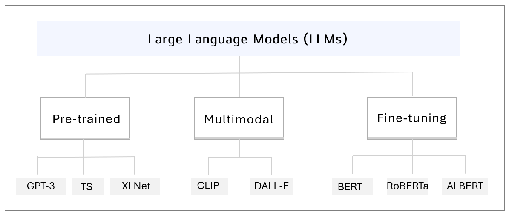

# 작업 부담(Task Load) 분석과 맞춤 조언 시스템

<br>

특정 작업을 수행할 때 느끼는 부담 정도를 체크하고, 그에 맞는 조언을 제시해주는 시스템을 개발했습니다. <br>

**LLM**을 통해 응답을 얻는 단순한 조언 생성이 아니라, **TLX 분석과 PCA 기법**을 통해 도출된 방향성과 강도를 입력으로 받아 <br>

그 맥락에 맞는 결과를 생성함으로써, 사용자는 보다 실질적인 가이드를 얻을 수 있습니다.

<br>

### - 목차 -

#### [1. Introduction](#1-Introduction)  
&nbsp;&nbsp; [1-1. 기획 배경](#-기획-배경)  

&nbsp;&nbsp; [1-2. 설계 개요](#-설계-개요)  

&nbsp;&nbsp; [1-3. NASA TLX (Task Load Index)](#-nasa-tlx-task-load-index)  

&nbsp;&nbsp; [1-4. PCA (Principal Component Analysis)](#-pca-principal-component-analysis)  

&nbsp;&nbsp; [1-5. LLM (Large Language Model)](#-llm-large-language-model)

#### [2. Implementation](#2-Implementation)  
&nbsp;&nbsp; [2-1. 구현 요약](#-구현-요약)  

&nbsp;&nbsp; [2-2. PCA 모델 설계 & 구현](#-pca-모델-설계-&-구현)  

&nbsp;&nbsp; [2-3. TLX 입력 & 처리](#-TLX-입력-&-처리)  

&nbsp;&nbsp; [2-4. LLM 연동 & 조언 생성](#-llm-연동-&-조언-생성)  

&nbsp;&nbsp; [2-5. 코드 구조](#-코드-구조)  

#### [3. Results](#3-Results)  
&nbsp;&nbsp; [3-1. 실행 화면](#-실행-화면)  


<br>

## 1. Introduction

<br>

### ◈ 기획 배경

<strong>인공지능(AI)</strong>이 기존의 컴퓨터공학과 비교했을 때 가장 두드러지는 차별점은 **정성적 신호를 정량화할 수 있다**라고 보았습니다. <br>

예컨대 AI 기반 자연어처리(NLP)가 없다면, 컴퓨터는 텍스트를 단순한 바이트 배열로만 인식하여 의미를 고려하지 못합니다. <br>

따라서 본 프로젝트는 **주관적인 입력**을 받아도, **측정 가능한 결과**를 AI를 통해 이끌어낼 수 있다는 전제를 배경으로 삼았습니다.

<br>

### ◈ 설계 개요

```
1) 어떤 주관 입력을 받을 것인가 

2) 입력을 어떻게 해석·정량화할 것인가 

3) 사용자에게 어떤 형태로 출력을 제시할 것인가
```

위 세 가지 요소를 중심으로, 각 단계를 구현할 수 있는 아이디어에 대해 고민했습니다. <br>

특히 `1) 입력` 기준을 잘 선정해야, 후속 단계에서 임의성을 줄이고 논리적 연결이 가능할 것이라 판단했습니다. <br>

또한 `2) 해석`과 `3) 출력`에 쓰일 AI 기능은 구현 가능성과 본질성에 초점을 맞췄습니다.

<br>

### ◈ NASA TLX (Task Load Index)

미국항공우주국(NASA)은 '비행사의 자동/수동 조종 간 부담 차이'를 비교하기 위해 <strong>작업 부하 지수(TLX)</strong>를 개발함 <br>

1988년에 논문으로 체계화된 이 TLX 기법은 '주관적 작업부하 평가 도구'로서, 사용자가 느낀 부담을

<br>

**① Mental Demand (정신적 요구)** : 과제가 얼마나 정신적으로 어렵고 복잡했나?

**② Physical Demand (신체적 요구)** : 신체적인 피로가 컸나?

**③ Temporal Demand (시간 압박)** : 시간이 얼마나 촉박했나?

**④ Performance (성과)** : 목표 달성 정도 및 자기 만족도는 어떠했나?

**⑤ Effort (노력)** : 얼마나 많은 노력을 기울였나?

**⑥ Frustration (좌절/짜증)** : 짜증과 불안을 얼마나 느꼈나?

<br>

위와 같은 6가지 항목으로 나누고, 사용자는 각 항목을 **0~100 척도**로 평가하게 됨

<br>


- 일반적으로 TLX 값은 6가지 항목의 **평균**으로 나타냄

- 단, Performance는 점수가 높을수록 **부담이 낮다는 것**을 의미하기 때문에 **역의 값**으로 넣음

- 따라서 TLX 값이 클수록, 사용자가 느끼는 작업 부담이 크다고 볼 수 있음

<br>

> [!IMPORTANT]
> NASA-TLX 기법은 현재까지도 항공 우주, 의료, 제조 등 다양한 분야에서 사실상 표준처럼 널리 쓰이고 있습니다. <br><br>
> 따라서 이 기법을 **본 프로젝트의 주관적 입력 요소**로 활용한다면, **방법론적 타당성**을 확보할 수 있을 것이라 판단했습니다.

<br>

### ◈ PCA (Principal Component Analysis)

주성분 분석(PCA)은 다차원 데이터의 차원을 축소시키면서, 데이터의 중요한 정보를 최대한 보존하는 통계 기법. <br>

여기서 중요한 정보란 <strong>데이터들이 흩어져 있는 방향과 정도(=분산)</strong>를 뜻함 <br>

따라서 데이터가 가장 넓게 퍼져 있는 방향을 첫 번째 주성분(PC1) 으로 잡고, <br>

PC1과 직교하면서 그다음으로 데이터가 퍼진 정도가 큰 방향을 두 번째 주성분(PC2)으로 잡음 <br>

PCA의 원리는 <strong>"PC1과 PC2만으로도 데이터의 큰 흐름을 이해할 수 있다"</strong>이기 때문에  <br> 

주성분 위에 다차원 데이터를 투영(projection)시킴으로써 정보를 더 적은 차원으로 압축시키게 됨

<br>


- PCA는 많은 feature를 몇 개의 핵심 축으로 압축해 **모델을 다루기 쉬운 형태로** 바꿔줌

- 상관관계가 얽힌 선형 모델이나, K-means 같은 클러스터링이 더 안정적으로 동작할 수 있게 해줌

- **컴퓨터비전(CV)** 분야에서는 얼굴 인식, 배경 제거, 이미지 압축 등에 쓰임

<br>

> [!IMPORTANT]
> **TLX의 6개 항목을 다차원 상태**로 보고, PCA를 적용해 주요 성분 (=핵심 방향)만 남기는 아이디어를 구상했습니다. <br><br>
> 이를 통해 덜 중요한 변동은 줄이고 **영향도가 큰 조합**을 찾아냄으로써, <br><br>
주관적 입력을 **일관된 좌표로 해석 및 정량화**할 수 있는 기준을 마련하는 데 PCA가 쓰일 수 있을 것이라 생각했습니다.

<br>

### ◈ LLM (Large Language Model)

대규모 언어 모델(LLM)은 방대한 텍스트 데이터로 학습된 AI 모델로 ChatGPT, Claude 등이 대표적인 예. <br> 

일반적으로 질문에 답하거나 요약·분류·생성 등 다양한 언어 관련 작업을 수행할 수 있음



- Pre-trained (사전학습) 모델 / Multimodal 모델 (텍스트+이미지+음성 처리) / Fine-tuning (특정 도메인 재학습) 

- 최근에는 별도의 학습 환경을 구축하지 않아도, **API 형태**로 손쉽게 호출 가능하도록 서비스를 제공함

<br>

> [!IMPORTANT]
> LLM 모델에게 **답변의 요구사항**을 정의함으로써 원하는 형식의 결과를 얻을 수 있다는 점에 주목했습니다. <br><br>
> 이는 특정한 질문이 명확히 담겨 있지 않은 요청이라도, 요구사항(예: 톤, 길이, 표현 방식)을 전달하면 <br><br>
> 그에 맞는 답을 생성할 수 있기에, LLM을 본 프로젝트의 **조언 제시 모듈**에 적용하고자 했습니다.

<br><br>

## 2. Implementation

<br>

### ◈ 구현 요약


### ◈ PCA 모델 설계 & 구현

<br>

#### 1️⃣ 주성분 (PC1, PC2) 설정하기

NASA-TLX의 6가지 항목들은 서로 독립적이라기보다는 **서로 상관된 축**을 가진다고 볼 수 있음. 예를 들면 <br>

> ⇒ Effort 항목과 Mental 항목은 일반적으로 같이 높아지거나 같이 낮아지는 경향이 있음 <br>
> ⇒ Frustration 항목 역시 Effort 및 Mental 부하가 높을수록 높아지는 경향이 있음 <br>

따라서 이런한 공통된 변동을 가장 폭넓게 설명할 수 있는 축을 주성분(PC1)이라 정의할 수 있음 <br>

즉 **"PC1 = 인지적 · 정신적 부하와 관련된 총합 축”** <br>

한편, PC2를 선정하기 위해선 PC1과 독립되는 (=PC1과 직교하는) 변동 요인을 찾아야 함. 예를 들면 <br>

> ⇒ Physical 항목과 Temporal 항목은 PC1 요인과는 **덜 상관된 축**으로 움직이는 경향이 있음 <br>
> ⇒ Physical 및 Temporal 부하가 높다고해서, 인지적·정신적 부하가 항상 높은 것은 아님 <br>

따라서 PC1 경향을 따르지 않으면서도, 별도의 영향력을 설명할 수 있는 축을 주성분(PC2)로 정의할 수 있음 <br>

즉 **"PC2 = 물리적 · 시간적 부하와 관련된 총합 축"**

<br>

#### 2️⃣ (u, v) 좌표와 사분면 정의하기

PC1과 PC2를 각각 x축(u)과 y축(v)으로 잡으면, **모든 TLX 입력값은 PCA 적용시 2차원 좌표 (u, v)로 투영**됨 <br>

따라서 PC1축과 PC2 축으로 형성된 좌표평면은 네 개의 사분면으로 나눌 수 있으며, 궁극적으로 <br>

각 영역에 속한 특정 데이터(u, v)들은 서로 다른 작업 부담도를 나타내도록 표현할 수 있음 <br>


> • Q1 (u ≥ 0, v ≥ 0) <br>
&nbsp; ৹ 인지적/정신적 부하와 물리·시간적 압박이 모두 높은 상태 <br>
&nbsp; ৹ 빠른 속도와 집중이 필요한 국면으로, 에너지 투입을 높여야 하는 상황 <br><br>
• Q2 (u < 0, v ≥ 0) <br>
&nbsp; ৹ 인지적/정신적 부하는 낮지만 물리·시간적 압박은 높은 상태 <br>
&nbsp; ৹ 성과 관리, 일정 조율, 범위·품질을 다듬는 쪽에 관리적 초점이 필요한 상황 <br><br>
• Q3 (u < 0, v < 0) <br>
&nbsp; ৹ 두 축 모두 낮아 전반적인 부담이 적은 상태 <br>
&nbsp; ৹ 현재 컨디션 유지에 적합하지만, 경우에 따라 몰입을 위한 동기 부여가 필요할 수 있는 상황 <br><br>
• Q4 (u ≥ 0, v < 0) <br>
&nbsp; ৹ 인지적/정신적 부하는 높은데 물리·시간 압박은 낮은 상태 <br>
&nbsp; ৹ 작업 리듬과 환경을 정돈하면서 집중을 효율적으로 분산시키는 전략이 유효한 상황

<br>

> [!TIP]
> 사용자가 입력한 TLX 항목들은 LLM에 직접 전달되지 않고, PCA 모델을 거쳐 **정량화된 tone 값으로 변환**됩니다. <br><br> 이를 통해 6가지 요소를 압축해 핵심 정보를 추려내고, 그에 집중한 맞춤형 조언을 생성할 수 있도록 했습니다.